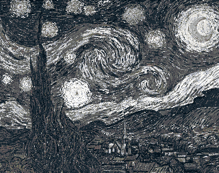

# Lego

## How to run

### Option 1: Run using Golang

```bash
go run main.go -image=./assets/starry_night-vincent_van-gogh.png -xlen=320 -ylen=253
```

### Option 2: Download the binary

Depending on the operating system you are on, you can download and use the [latest released](https://github.com/noelruault/lego/releases/latest) binary

Or use the following magic command to do such download automatically (tested on MacOS):

```bash
if [[ $(uname -p) == 'i386' ]]; then CHIP=amd; else CHIP=$(uname -p); fi; \
OS=$(uname -s | tr '[:upper:]' '[:lower:]'); \
curl -s https://api.github.com/repos/noelruault/lego/releases/latest \
| grep "browser_download_url" \
| grep "$OS.*$CHIP" \
| cut -d : -f 2,3 \
| tr -d \" \
| xargs wget -qO- \
| tar xvz
```

Providing an input file with a suitable data structure is necessary for writing data to the invoice.

Download an input image and a csv containing the available colors

```bash
wget -P . \
    https://github.com/noelruault/lego/blob/main/assets/starry_night-vincent_van-gogh.png
```

Run the binary

```bash
./lego \
    -image=./assets/starry_night-vincent_van-gogh.png \
    -xlen=320 \
    -ylen=253
```
> Resolve MacOS ["cannot be opened because the developer cannot be verified"](https://gist.github.com/noelruault/6d67933c95127b592c44eaee25dfc7e9) error

## Colors: Palette

This program uses by default the original LEGO™ colors, which I obtained from [rebrickable.com](https://rebrickable.com/downloads/).
In the root directory you can find the two files, one containing all the colors [lego-all-colors.csv](./lego-all-colors.csv) and one containing only the different shades of gray.
Any CSV file with a similar format can be supplied from the command line to alter the colors to be used to represent the image.

Next I'm attaching the exact commands I used to genereate the following outputs:

```bash
go run main.go -image=./assets/starry_night-vincent_van-gogh.png -xlen=320 -ylen=253 -colors=./lego-grayscale.csv
```



```bash
go run main.go -image=./assets/starry_night-vincent_van-gogh.png -xlen=320 -ylen=253 -colors=./lego-all-colors.csv
```


## Author

[@noelruault](https://noel.engineer)

## Acknowledgments

Thanks to [@Daak2](https://github.com/Daak2) with whom I discussed conceptually the idea of this project and motivated me to implement it.

## Useful references

* [Working with Images in Go](https://www.devdungeon.com/content/working-images-go)
